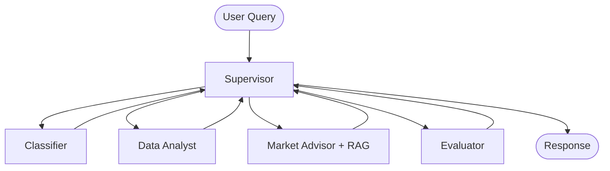

# Powerline Battery Co-Pilot

An agentic AI system for battery portfolio operations, built for the Powerline take-home assignment. The assistant answers questions about energy asset performance, compares results against Powerline-perfect benchmarks, and recommends market strategy improvements.

## Overview

This project implements a **multi-agent LangGraph workflow** that mirrors Powerline's Battery Co-Pilot product:

- **Supervisor** orchestrates specialist agents
- **Classifier** parses user intent, assets, and time ranges
- **Data Analyst** runs SQL-backed analytics tools over `data.csv`
- **Market Advisor** combines data results with RAG domain knowledge
- **Evaluator** validates answer quality before responding

See [architecture.md](architecture.md) for the full design document.

## Architecture



## Features

| Capability | Implementation |
|------------|----------------|
| LangGraph orchestration | `StateGraph` with supervisor routing |
| Tools | Revenue metrics, benchmark comparison, time-series aggregation, charts |
| RAG | Chroma-free embedding search over energy domain docs |
| Short-term memory | LangGraph `MemorySaver` checkpointer per session |
| Long-term memory | SQLite-backed user memory store |
| OpenAI | `gpt-4o-mini` + `text-embedding-3-small` |

## Project Structure

```text
Powerline-Agent/
├── architecture.md       # Detailed architecture design
├── README.md             # This file
├── main.py               # Interactive CLI
├── requirements.txt
├── example.env
├── data/
│   ├── data.csv          # Battery operations dataset
│   └── knowledge/        # RAG source documents
├── src/
│   ├── workflow.py       # LangGraph compilation
│   ├── state.py          # Shared agent state
│   ├── data_loader.py    # CSV → SQLite loader
│   ├── agents/           # Specialist agent nodes
│   ├── tools/            # Data and memory tools
│   └── retrieval/        # RAG pipeline
└── tests/
```

## Setup

```bash
cd Powerline-Agent
python -m venv .venv
source .venv/bin/activate
pip install -r requirements.txt
cp example.env .env
```

Add your OpenAI API key to `.env`:

```env
OPENAI_API_KEY=sk-...
OPENAI_MODEL=gpt-4o-mini
OPENAI_EMBEDDING_MODEL=text-embedding-3-small
```

Replace `data/data.csv` with the assignment dataset if provided separately.

## Usage

### Interactive CLI

```bash
python main.py
```

Example queries:

- "What is the total revenue for each asset?"
- "Which asset has the lowest capture rate?"
- "Compare actual revenue against the benchmark for asset_001"
- "Explain capture rate and how to improve it"

### Run Tests

```bash
pytest tests/ -q
```

## Agents

### Supervisor
Central router. Reads graph state and dispatches to the next specialist based on intent, available data, and evaluation status.

### Classifier
Structured LLM output (`ClassificationResult`) identifying intent category, target assets, and time range.

### Data Analyst
ReAct agent with access to SQL-backed tools. Computes metrics from `data.csv` without generating free-form code.

### Market Advisor
Combines tool outputs with RAG-retrieved domain knowledge to produce grounded recommendations.

### Evaluator
Quality gate checking grounding, completeness, and hallucination risk. Retries up to 2 times if quality is insufficient.

## Tools

| Tool | Purpose |
|------|---------|
| `query_asset_data` | Filter operational rows |
| `compute_revenue_metrics` | Revenue, benchmark, capture rate aggregates |
| `benchmark_comparison` | Gap analysis by asset or day |
| `time_series_aggregate` | Daily/hourly metric rollups |
| `generate_chart` | Matplotlib chart export |
| `retrieve_domain_knowledge` | RAG search over knowledge docs |
| `store_long_term_memory` | Persist cross-session context |
| `retrieve_long_term_memory` | Load prior user context |

## Memory

**Short-term**: LangGraph checkpointer keyed by `thread_id` — enables multi-turn follow-ups within a session.

**Long-term**: SQLite `memory.db` stores user preferences, analysis summaries, and strategy notes keyed by `user_id`.

## RAG Knowledge Base

Documents in `data/knowledge/`:

- `battery_operations.md` — SOC, power/energy, revenue formulas
- `market_trading_basics.md` — spot markets, bidding, capture rate
- `benchmarking_methodology.md` — Powerline-perfect benchmark methodology

## Design Decisions

1. **SQL tools over code generation** — safer, auditable numeric results for energy metrics
2. **Supervisor pattern** — separates data analysis from advisory reasoning
3. **Evaluator retry loop** — reduces hallucinated metrics in final answers
4. **Schema adapter** — normalizes varying CSV column names from the assignment dataset

## Data

The included `data/data.csv` contains 7 days of 15-minute interval records for 3 battery assets in the NEM market. Replace with the official assignment file when available — the schema adapter handles common column name variations.

## Author

Jasdeep Sidhu — Agentic AI Engineer portfolio project
