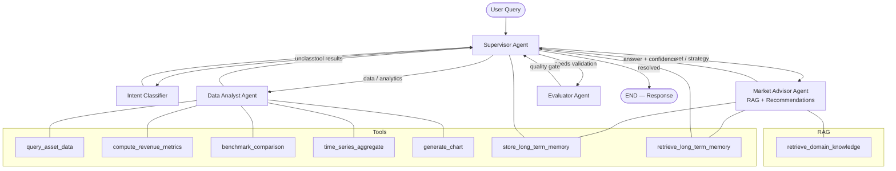
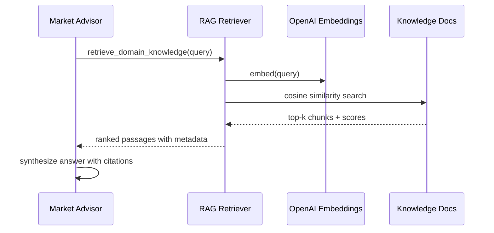

# Powerline Battery Co-Pilot — Agentic AI Architecture

## 1. Assignment Context

This document describes the architecture for an **agentic AI system** built for the Powerline take-home assignment. The system mirrors Powerline's **Battery Co-Pilot™** product vision: an AI assistant that helps energy asset operators **reason over operational time-series data**, **explain market performance**, and **recommend actions** to improve battery portfolio revenue.

The solution is implemented with:

| Requirement | Implementation |
|-------------|----------------|
| **LangGraph** | Multi-agent `StateGraph` with supervisor routing and conditional edges |
| **Tools** | Pandas/SQL analytics, metrics, benchmarking, and chart generation over `data.csv` |
| **RAG** | Domain knowledge retrieval over energy-market and battery-operations documents |
| **Memory** | Short-term session memory (LangGraph checkpointer) + long-term SQLite memory |
| **OpenAI API** | `gpt-4o-mini` for agent reasoning; `text-embedding-3-small` for RAG embeddings |

---

## 2. Problem Statement

Battery portfolio operators need to answer questions such as:

- *"What was total revenue last week vs. the Powerline-perfect benchmark?"*
- *"When did Asset A miss arbitrage opportunities during price spikes?"*
- *"Which intervals had the lowest state-of-charge utilization?"*
- *"Explain why revenue underperformed on Tuesday afternoon."*
- *"What bidding strategy changes would improve capture rate?"*

These questions require **multi-step reasoning**: classify intent → query structured data → retrieve domain context → synthesize an actionable answer → validate quality before responding.

A single LLM prompt cannot reliably perform this. An **agentic workflow** decomposes the problem into specialized agents coordinated by a supervisor.

---

## 3. High-Level Architecture



### Design Pattern: Supervisor (Hub-and-Spoke)

Following the proven pattern from UDA-Hub, a **central Supervisor** reads shared graph state and routes to specialist agents. Specialists never talk directly to the user; they return structured results to the Supervisor, which decides the next step or terminates.

**Why this pattern?**

- Energy questions often span **data analysis** and **market strategy** — routing keeps each agent focused.
- The Supervisor can **retry** or **escalate** when confidence is low.
- New specialists (e.g., forecasting, alerting) can be added without rewriting the entire graph.

---

## 4. Data Layer

### 4.1 Primary Dataset: `data/data.csv`

The assignment provides a CSV of battery asset operational records. The loader introspects the schema at startup and registers column metadata for tool prompts.

**Expected schema** (flexible — adapter handles variations):

| Column | Type | Description |
|--------|------|-------------|
| `timestamp` | datetime | Trading interval start (typically 5-min or 15-min) |
| `asset_id` | string | Battery project identifier |
| `market` | string | Electricity market (e.g., `NEM`, `CAISO`, `ERCOT`) |
| `power_mw` | float | Net power (+ discharge, − charge) |
| `energy_mwh` | float | Energy transferred in interval |
| `state_of_charge_pct` | float | SOC as percentage (0–100) |
| `market_price_usd_mwh` | float | Locational marginal or spot price |
| `revenue_usd` | float | Realized revenue for the interval |
| `benchmark_revenue_usd` | float | Powerline-perfect benchmark revenue |
| `capture_rate` | float | `revenue / benchmark_revenue` ratio |

If the provided CSV uses different column names, a **schema mapping layer** normalizes them before tools execute.

### 4.2 Derived SQLite View

On first run, `data.csv` is loaded into an in-memory SQLite database via Pandas. Tools execute **parameterized SQL** rather than raw LLM-generated code, improving safety and reproducibility.

```text
data/
├── data.csv              # Assignment dataset
└── knowledge/            # RAG source documents
    ├── battery_operations.md
    ├── market_trading_basics.md
    └── benchmarking_methodology.md
```

---

## 5. Agent Roles

| Agent | Responsibility | Tools | Output |
|-------|----------------|-------|--------|
| **Supervisor** | Orchestrates flow; decides next agent or finish | `retrieve_long_term_memory` | `next_agent`, routing decision |
| **Classifier** | Determines query type, complexity, target assets/time range | None (structured LLM output) | `intent`, `time_range`, `asset_ids`, `complexity` |
| **Data Analyst** | Executes quantitative analysis on CSV/SQLite | `query_asset_data`, `compute_revenue_metrics`, `benchmark_comparison`, `time_series_aggregate`, `generate_chart` | Structured metrics, tables, chart paths |
| **Market Advisor** | Combines RAG domain knowledge with data findings to produce recommendations | `retrieve_domain_knowledge`, memory tools | Answer text, `confidence_score`, recommendations |
| **Evaluator** | Validates factual grounding, completeness, and safety before response | None | `quality_score`, `issues`, `approved` |

### 5.1 Intent Categories

The Classifier assigns one primary intent:

| Intent | Example Query | Routed To |
|--------|---------------|-----------|
| `performance_summary` | "Summarize last week's revenue by asset" | Data Analyst → Market Advisor |
| `benchmark_analysis` | "How far are we from perfect benchmark?" | Data Analyst → Market Advisor |
| `anomaly_investigation` | "Why did revenue drop on March 3?" | Data Analyst → Market Advisor |
| `strategy_recommendation` | "How should we adjust bidding?" | Market Advisor (RAG-heavy) |
| `exploratory` | "What columns are in the dataset?" | Data Analyst |
| `general_knowledge` | "What is capture rate?" | Market Advisor |

---

## 6. LangGraph State Design

```python
class AgentState(TypedDict):
    # Conversation
    messages: Annotated[list[BaseMessage], add_messages]
    user_query: str

    # Classification
    intent: Optional[str]
    time_range: Optional[dict]
    asset_ids: Optional[list[str]]
    complexity: Optional[str]

    # Analysis results
    data_results: Optional[dict]
    chart_paths: Optional[list[str]]

    # Advisory
    draft_answer: Optional[str]
    recommendations: Optional[list[str]]
    confidence_score: Optional[float]

    # Quality gate
    quality_score: Optional[float]
    approved: Optional[bool]

    # Routing
    next_agent: str
    resolution_status: str  # pending | resolved | needs_retry

    # Session context
    session_id: str
    user_id: Optional[str]
    actions_taken: Annotated[list[str], operator.add]
```

### 6.1 Graph Flow

```text
START
  → supervisor
      ├── (no intent)           → classifier → supervisor
      ├── (needs data)          → data_analyst → supervisor
      ├── (needs advisory)      → market_advisor → supervisor
      ├── (needs validation)    → evaluator → supervisor
      └── (approved)            → END
```

### 6.2 Conditional Routing Logic

```
Supervisor Decision Tree:
├── intent is empty?                          → classifier
├── resolution_status == "resolved"?          → END
├── data_results empty AND intent needs data? → data_analyst
├── draft_answer empty AND has data_results?  → market_advisor
├── approved is False AND retries < 2?        → market_advisor (with feedback)
├── approved is False AND retries >= 2?       → END (best-effort + disclaimer)
├── draft_answer exists AND not evaluated?    → evaluator
└── approved is True?                         → END
```

---

## 7. Tools

All tools return **JSON-serializable dicts** so agents can chain results without parsing free text.

### 7.1 Data Tools

| Tool | Description | Key Parameters |
|------|-------------|----------------|
| `query_asset_data` | Filter rows by asset, time range, columns | `asset_id`, `start`, `end`, `columns` |
| `compute_revenue_metrics` | Total revenue, avg capture rate, best/worst intervals | `asset_id`, `start`, `end` |
| `benchmark_comparison` | Compare actual vs benchmark; compute gap and rank | `asset_id`, `start`, `end`, `group_by` |
| `time_series_aggregate` | Resample and aggregate (hourly/daily) | `asset_id`, `freq`, `metric` |
| `generate_chart` | Produce matplotlib chart saved to `outputs/` | `chart_type`, `asset_id`, `metric`, `start`, `end` |

### 7.2 Memory Tools

| Tool | Description |
|------|-------------|
| `store_long_term_memory` | Persist user preferences, past analysis summaries, asset focus |
| `retrieve_long_term_memory` | Fetch relevant prior context for returning users |

### 7.3 RAG Tool

| Tool | Description |
|------|-------------|
| `retrieve_domain_knowledge` | Semantic search over `data/knowledge/` documents |

---

## 8. RAG Pipeline



### 8.1 Knowledge Base Content

Documents cover concepts the LLM should not hallucinate:

- **Battery operations**: SOC limits, ramp rates, cycling constraints
- **Market trading**: spot vs ancillary markets, bidding, price spikes
- **Benchmarking**: Powerline-perfect benchmark definition, capture rate interpretation
- **Recommendations framework**: when to suggest bid-spread adjustments vs SOC target changes

### 8.2 Indexing Strategy

1. Load markdown files from `data/knowledge/`
2. Split into ~500-token chunks with 50-token overlap
3. Embed with `text-embedding-3-small`
4. Store in ChromaDB (local persistent) or in-memory for lightweight deployment
5. Return top-3 chunks; use max score as RAG confidence signal

---

## 9. Memory Architecture

### 9.1 Short-Term Memory (Session)

| Property | Value |
|----------|-------|
| **Implementation** | LangGraph `MemorySaver` checkpointer |
| **Key** | `thread_id` (= session UUID) |
| **Scope** | Full message history + agent state within one conversation |
| **Use case** | Multi-turn follow-ups: *"Now break that down by asset"* |

### 9.2 Long-Term Memory (Cross-Session)

| Property | Value |
|----------|-------|
| **Implementation** | SQLite `memory.db` |
| **Key** | `user_id` |
| **Categories** | `asset_focus`, `analysis_summary`, `preference`, `strategy_note` |
| **Use case** | Remember that user primarily monitors `asset_001`; avoid re-explaining basics |

### 9.3 Conversation Summarization

After each resolved turn, the Supervisor triggers a lightweight summarization step that writes a compact `analysis_summary` to long-term memory if the exchange produced novel insights.

---

## 10. OpenAI Integration

| Component | Model | Purpose |
|-----------|-------|---------|
| Agent reasoning | `gpt-4o-mini` | Classification, analysis planning, answer synthesis |
| Embeddings | `text-embedding-3-small` | RAG vector search |
| Structured output | Pydantic via `with_structured_output()` | Intent, evaluation scores |

### 10.1 Configuration

```env
OPENAI_API_KEY=sk-...
OPENAI_MODEL=gpt-4o-mini
OPENAI_EMBEDDING_MODEL=text-embedding-3-small
```

Temperature is set to **0** for deterministic tool selection and numeric consistency.

---

## 11. Evaluator Agent (Quality Gate)

Before returning to the user, the Evaluator checks:

1. **Grounding**: Answer references metrics that exist in `data_results`
2. **Completeness**: Query aspects are addressed (time range, assets, metrics)
3. **Hallucination risk**: No fabricated numbers not present in tool output or RAG
4. **Actionability**: Recommendations are specific when intent is `strategy_recommendation`

| Score | Action |
|-------|--------|
| `quality_score >= 0.75` | Approve → END |
| `0.5 ≤ quality_score < 0.75` | Retry Market Advisor with evaluator feedback (max 2 retries) |
| `quality_score < 0.5` | Return best-effort answer with explicit uncertainty disclaimer |

---

## 12. Project Structure

```text
Powerline-Agent/
├── architecture.md          # This document
├── README.md                # Setup, design rationale, usage
├── main.py                  # CLI entry point
├── requirements.txt
├── example.env
├── data/
│   ├── data.csv             # Assignment dataset
│   └── knowledge/           # RAG documents
├── outputs/                 # Generated charts (gitignored)
├── src/
│   ├── state.py             # AgentState TypedDict
│   ├── workflow.py          # LangGraph compilation
│   ├── prompts.py           # System prompts per agent
│   ├── agents/
│   │   ├── supervisor.py
│   │   ├── classifier.py
│   │   ├── data_analyst.py
│   │   ├── market_advisor.py
│   │   └── evaluator.py
│   ├── tools/
│   │   ├── data_tools.py
│   │   └── memory_tools.py
│   ├── retrieval/
│   │   └── rag.py
│   └── data_loader.py       # CSV → SQLite + schema introspection
└── tests/
    ├── test_data_tools.py
    ├── test_rag.py
    └── test_workflow.py
```

---

## 13. Execution Modes

### 13.1 Interactive CLI

```bash
python main.py
> What was total revenue for asset_001 last week?
```

Multi-turn session uses the same `thread_id` for short-term memory continuity.

### 13.2 Programmatic API

```python
from src.workflow import build_app

app = build_app()
result = app.invoke(
    {"user_query": "Compare capture rates across assets"},
    config={"configurable": {"thread_id": "session-abc"}}
)
print(result["draft_answer"])
```

---

## 14. Error Handling & Observability

| Risk | Mitigation |
|------|------------|
| Invalid JSON from LLM | `try/except` with fallback defaults per agent |
| SQL injection via tool params | Parameterized queries only; no free-form SQL from LLM |
| Infinite routing loops | LangGraph `recursion_limit=25`; max 2 evaluator retries |
| Missing CSV columns | Schema adapter with clear error messages to user |
| Empty RAG results | Market Advisor proceeds with data-only context; lowers confidence |
| API rate limits | Exponential backoff on OpenAI calls |

**Logging**: Structured logs via Python `logging` — routing decisions, tool invocations, confidence/quality scores, retry events.

---

## 15. Testing Strategy

| Layer | Tests |
|-------|-------|
| **Unit** | Data tools against fixture CSV; RAG retrieval ranking; prompt formatting |
| **Integration** | End-to-end graph with mocked LLM for deterministic routing |
| **Evaluation** | Curated question set with expected metrics (revenue totals, capture rates) |

Example evaluation queries:

1. *"What is the total revenue for all assets in the dataset?"* → verify sum matches ground truth
2. *"Which asset has the lowest average capture rate?"* → verify ranking
3. *"Explain capture rate"* → verify RAG citation, no numeric hallucination

---

## 16. Implementation Phases

| Phase | Deliverable | Status |
|-------|-------------|--------|
| **Phase 1** | Architecture design (this document) | ✅ |
| **Phase 2** | Data loader, tools, RAG index | Planned |
| **Phase 3** | LangGraph agents + workflow | Planned |
| **Phase 4** | CLI, README, tests | Planned |
| **Phase 5** | Evaluation notebook + demo queries | Planned |

---

## 17. Design Decisions & Tradeoffs

| Decision | Rationale | Alternative Considered |
|----------|-----------|-------------------------|
| Supervisor pattern vs single ReAct agent | Better separation of data vs advisory reasoning; easier to test | Single `create_react_agent` (simpler but mixes concerns) |
| SQL tools vs LLM-generated pandas code | Safer, reproducible, auditable numeric results | Code interpreter (more flexible, higher hallucination risk) |
| ChromaDB for RAG | Persistent, simple local setup | In-memory embeddings (lighter but no persistence) |
| Evaluator retry loop | Reduces hallucinated metrics in final answers | Trust first draft (faster but lower quality) |
| gpt-4o-mini | Cost-effective for multi-agent calls | gpt-4o (higher quality, higher cost/latency) |

---

## 18. Alignment with Powerline Product Vision

This architecture directly maps to Battery Co-Pilot capabilities:

| Battery Co-Pilot Feature | Agentic Implementation |
|--------------------------|------------------------|
| Continuous Benchmarking | `benchmark_comparison` tool + Data Analyst |
| Fleet-Wide Comparison | Multi-asset aggregation in `compute_revenue_metrics` |
| Actionable Recommendations | Market Advisor + RAG strategy documents |
| Zero Operational Risk | Read-only CSV analysis; no live trading actions |
| Expert Decision Support | Multi-turn memory + explainable tool outputs |

---

## 19. Next Steps

1. Place assignment `data.csv` in `Powerline-Agent/data/`
2. Implement Phase 2–4 per project structure above
3. Run evaluation queries and tune prompts/confidence thresholds
4. Record a brief demo of multi-turn analysis workflow

---

*Document version: 1.0 — Powerline Take-Home Assignment*
