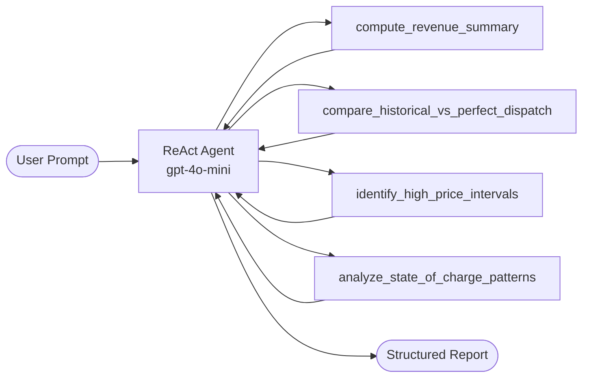

# Architecture — Powerline Battery Performance Agent

## Goal

Build a simple LLM agent that analyzes one week of battery interval data, compares historical vs perfect-foresight operation, and produces actionable recommendations — **using tools, not raw data in the prompt**.

## Design

## Why This Structure

| Choice | Rationale |
|--------|-----------|
| **Single ReAct agent** | Assignment asks for a simple, clearly structured workflow — not a multi-agent system |
| **Python tool functions** | Grounded numeric results; LLM reasons over tool JSON, not CSV rows |
| **LangGraph `create_react_agent`** | Minimal orchestration with built-in tool-calling loop |
| **Schema alias adapter** | Same code runs on any CSV matching the schema (generalization requirement) |
| **Structured output prompt** | Ensures gap, drivers, and 2 recommendations are always present |

## Data Schema

One row per interval (typically 15-minute, one week ≈ 672 rows):

| Column | Description |
|--------|-------------|
| `timestamp` | Interval start |
| `market_price_usd_mwh` | Spot/LMP price |
| `historical_power_mw` | Actual dispatch (+ discharge, − charge) |
| `perfect_power_mw` | Perfect-foresight counterfactual dispatch |
| `historical_revenue_usd` | Revenue from historical dispatch |
| `perfect_revenue_usd` | Revenue from perfect dispatch |
| `state_of_charge_pct` | Historical SOC |
| `perfect_state_of_charge_pct` | Perfect-foresight SOC (optional) |

## Tool Design

Each tool returns JSON with pre-computed metrics. The LLM cites these values in its report.

1. **`compute_revenue_summary`** — Answers: what is the total gap?
2. **`compare_historical_vs_perfect_dispatch`** — Answers: where are the biggest misses?
3. **`identify_high_price_intervals`** — Answers: did we capture price spikes?
4. **`analyze_state_of_charge_patterns`** — Answers: did SOC limit discharge?

## Agent Workflow

1. User sends analysis prompt via `main.py`
2. Agent calls tools (typically all four analysis tools)
3. Agent synthesizes report with required sections:
   - Performance gap (historical, perfect, gap)
   - Key driver + evidence
   - Secondary factor + evidence
   - 2 recommendations (action, rationale, benefit, tradeoff)

## What We Avoided

- Uploading CSV into a single LLM prompt
- One-shot end-to-end generation without tools
- Over-engineered multi-agent routing, RAG, or memory layers
- Generic recommendations not tied to tool outputs

## Extension Points

If expanding beyond the take-home scope:

- Add a `--dry-run` mode that prints tool outputs without calling the LLM
- Add structured Pydantic output parsing for machine-readable reports
- Add evaluation harness with expected metric assertions
