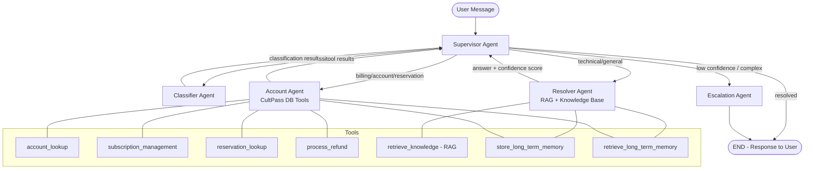

# UDA-Hub Multi-Agent Architecture Design

## Overview

UDA-Hub is a multi-agent customer support system for CultPass, built with LangGraph. It follows a **Supervisor pattern** (hub-and-spoke) where a central Supervisor agent orchestrates four specialist agents to classify, resolve, perform account operations, and escalate customer support tickets.

## Architecture Diagram



## Agent Roles and Responsibilities

| Agent | Role | Tools Available | Input | Output |
|-------|------|----------------|-------|--------|
| **Supervisor** | Central orchestrator. Reads state and routes to the appropriate specialist. | None | Full agent state + messages | `next_agent` routing decision |
| **Classifier** | Analyzes ticket content to determine category, urgency, and complexity. | None | User message | `classification`, `urgency`, `complexity` |
| **Resolver** | Searches knowledge base via RAG to answer questions. Sets confidence score. | `retrieve_knowledge`, `store_long_term_memory`, `retrieve_long_term_memory` | User message + classification | Answer + `confidence_score` + `resolution_status` |
| **Account Agent** | Performs CultPass database operations (account lookup, subscription management, refunds, reservations). | `account_lookup`, `subscription_management`, `reservation_lookup`, `process_refund`, memory tools | User message + classification | Tool results + `resolution_status` |
| **Escalation** | Creates a human-readable summary and escalates to human support. | None | Full context from prior agents | Escalation message + `resolution_status: escalated` |

## Decision Flow

1. **START**: User message enters the graph.
2. **Supervisor** checks if the ticket has been classified:
   - If not classified → route to **Classifier**
   - If classified → route based on category
3. **Classifier** sets `classification`, `urgency`, `complexity` → returns to Supervisor.
4. **Supervisor** reads classification and routes:
   - `billing`, `account`, `reservation` → **Account Agent**
   - `technical`, `general` → **Resolver**
5. **Resolver** does RAG search:
   - If `confidence_score >= 0.6` → sets `resolution_status: resolved` → Supervisor routes to FINISH
   - If `confidence_score < 0.6` → Supervisor routes to **Escalation**
6. **Account Agent** executes DB tools → sets `resolution_status: resolved` → Supervisor routes to FINISH
7. **Escalation** creates summary → terminates flow

## Routing Logic

```
Supervisor Decision Tree:
├── classification == empty? → classifier
├── resolution_status == "resolved"? → FINISH
├── resolution_status == "escalated"? → FINISH
├── confidence_score < 0.6 AND already tried resolver? → escalation
├── classification in (billing, account, reservation)? → account_agent
├── classification in (technical, general)? → resolver
└── default → resolver
```

## Memory Architecture

### Short-term Memory (Within Session)
- **Implementation**: LangGraph `MemorySaver` checkpointer
- **Key**: `thread_id` (maps to ticket ID)
- **Scope**: Full message history and agent state within one conversation
- **Use case**: Multi-turn conversations, context continuity

### Long-term Memory (Across Sessions)
- **Implementation**: SQLite `memory.db` with `LongTermMemory` table
- **Key**: `user_id` (CultPass external user ID)
- **Categories**: `resolved_issue`, `preference`, `escalation_history`
- **Use case**: Returning customer personalization, avoiding re-asking solved questions

### Conversation Persistence
- **Implementation**: UDA-Hub `ticket_messages` table
- **Scope**: All messages (user, AI, system) stored per ticket
- **Use case**: Audit trail, loading history for returning customers

## RAG Pipeline (Knowledge Retrieval)

1. **Data Source**: Knowledge articles loaded from `udahub.db` Knowledge table (14+ articles)
2. **Embedding**: OpenAI `text-embedding-3-small` model
3. **Index**: In-memory list of (article_dict, embedding_vector) tuples
4. **Search**: Cosine similarity between query embedding and article embeddings
5. **Results**: Top 3 articles returned with relevance scores
6. **Confidence**: Maximum relevance score among retrieved articles
7. **Threshold**: `confidence >= 0.6` → resolved; `< 0.6` → escalation

## Tools (Database Abstraction via FastMCP)

All CultPass database operations are abstracted through tools decorated with `@mcp.tool()` from FastMCP:

| Tool | Description | Parameters |
|------|-------------|------------|
| `account_lookup` | Find user by email, return profile + subscription | `email: str` |
| `subscription_management` | Check/cancel/pause/reactivate subscription | `user_id: str, action: str` |
| `reservation_lookup` | List user's reservations with experience details | `user_id: str` |
| `process_refund` | Process a refund with reference number | `user_id: str, reason: str, amount: str` |
| `retrieve_knowledge` | RAG search over knowledge base | `query: str` |
| `store_long_term_memory` | Save user interaction summary | `user_id, category, summary, details` |
| `retrieve_long_term_memory` | Get past context for a user | `user_id: str` |

## Error Handling

- **Invalid JSON from LLM**: All agents have `try/except json.JSONDecodeError` with sensible fallback defaults
- **Unknown tool calls**: Agents return structured error messages
- **Missing user data**: Tools return descriptive "not found" responses
- **Loop prevention**: LangGraph's `recursion_limit` (default 25) prevents infinite loops
- **Tool iteration cap**: Each agent limits tool-calling iterations to 5

## Logging

All agents and the workflow use Python's `logging` module with structured output:
- Logger names: `udahub.workflow`, `udahub.supervisor`, `udahub.classifier`, `udahub.resolver`, `udahub.account_agent`, `udahub.escalation`
- Logged events: routing decisions, tool calls, confidence scores, classification results, escalation triggers
